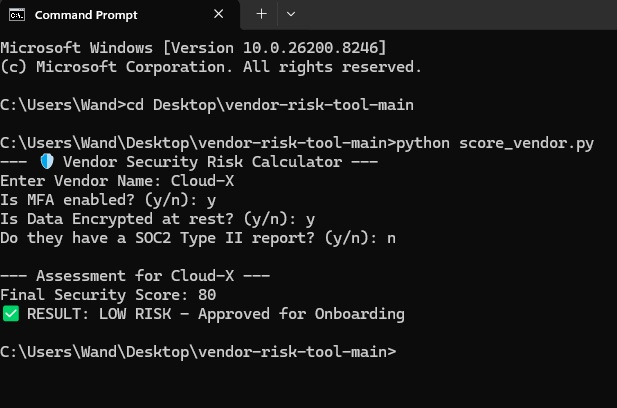
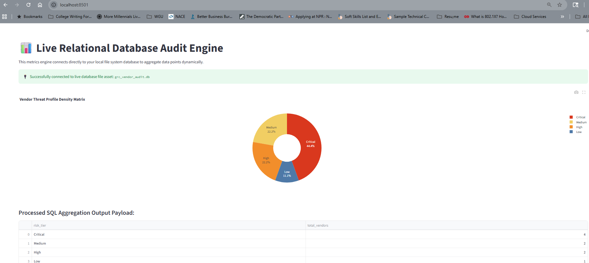

# Third-Party Vendor Risk Management Tool

A practical Governance, Risk and Compliance (GRC) project for evaluating third-party vendors, recording assessment evidence and analyzing vendor risk trends. It combines a Python command-line assessment tool, a Streamlit dashboard and reusable SQLite/ANSI SQL audit queries.

## Resume Summary

**Third-Party Vendor Risk Management Tool | Python, SQLite, SQL, Streamlit, Pandas, Plotly**

- Built a weighted vendor security scoring workflow based on MFA, encryption at rest and SOC 2 evidence.
- Automated vendor assessment recording to a CSV risk register for audit evidence and historical tracking.
- Created SQL audit queries using `GROUP BY`, `COUNT`, `SUM`, `HAVING`, subqueries and joins to identify risk concentration, SLA breaches and non-compliant vendors.
- Developed an interactive Streamlit dashboard that visualizes risk-tier distribution with Pandas and Plotly.

## What This Project Demonstrates

- **Governance:** A documented vendor risk policy with security control weights and approval thresholds.
- **Risk management:** A repeatable score from 0 to 100 based on weighted security controls.
- **Compliance operations:** CSV-based assessment evidence and SQL-based vendor audit reporting.
- **Technical implementation:** Python scripting, SQLite queries, data analysis and interactive visualization.

## Architecture

```text
Vendor security answers
          |
          v
score_vendor.py  --->  risk_register.csv

SQL sample data  --->  vendor_audit_queries.sql
          |
          v
database_audit.py ---> Streamlit dashboard
```

The Python scorer and dashboard are separate demonstrations: the scorer writes new assessments to `risk_register.csv`, while the dashboard currently uses an in-memory SQLite dataset for risk-distribution visualization. The SQL files contain additional audit exercises and can be run independently.

## Risk Scoring Model

| Security control | Weight | Score impact when answer is `n` |
| --- | ---: | ---: |
| MFA enabled | 40% | -40 |
| Data encrypted at rest | 40% | -40 |
| SOC 2 Type II report available | 20% | -20 |

The current Python implementation classifies scores below 70 as `HIGH RISK`; scores of 70 or above are classified as `LOW RISK`. The policy document also defines a 70-79 medium-risk review band, which is a planned enhancement to align the script exactly with the policy.

## Tech Stack

- Python 3.10+
- Streamlit
- Pandas
- Plotly
- SQLite / ANSI SQL
- CSV and Git

## Run Locally

Open PowerShell in the project directory:

```powershell
cd D:\vendor-risk-tool
```

### 1. Install dependencies

```powershell
python -m pip install pandas plotly streamlit
```

### 2. Run the vendor assessment CLI

```powershell
python score_vendor.py
```

Enter the vendor name and answer `y` or `n` for each control. The result is appended to `risk_register.csv`.

### 3. Run the interactive dashboard

```powershell
python -m streamlit run database_audit.py
```

Open `http://localhost:8501` in a browser. `python -m streamlit` is recommended because it works even when the standalone `streamlit` command is not on the Windows PATH.

### 4. Run the SQL audit exercises

The SQL scripts can be opened and executed in SQLite, DBeaver or another compatible SQL client:

- `setup_vendor_audit.sql` creates the vendor audit schema and sample data.
- `vendor_audit_queries.sql` demonstrates risk grouping, SLA-breach analysis and vendor-contact joins.
- `vendor_risk_group_metrics.sql` creates a risk summary view and compares vendors with their group average.

For a quick SQLite command-line run:

```powershell
sqlite3 vendor_audit.db ".read setup_vendor_audit.sql"
sqlite3 vendor_audit.db ".read vendor_audit_queries.sql"
```

## Project Files

| File | Purpose |
| --- | --- |
| `score_vendor.py` | Interactive weighted vendor assessment and CSV logging |
| `database_audit.py` | Streamlit dashboard with SQLite metrics and Plotly chart |
| `risk_register.csv` | Assessment history and audit evidence |
| `POLICY.md` | Control weights and risk approval policy |
| `setup_vendor_audit.sql` | Relational audit schema and sample records |
| `vendor_audit_queries.sql` | Risk, compliance, SLA and contact analysis queries |
| `vendor_risk_group_metrics.sql` | Risk-group summary view and benchmark query |

## Interview Explanation

**Problem:** Vendor security reviews are often inconsistent and difficult to track manually.

**Solution:** I converted three common security checks into a weighted score, stored the outcome as an audit record, and added SQL reporting for larger vendor datasets. The dashboard provides a quick visual view of risk concentration for decision-makers.

**Why these weights?** MFA and encryption directly reduce unauthorized access and data confidentiality risk, so they carry 40% each. SOC 2 evidence provides independent assurance and carries the remaining 20%.

**How would I improve it for production?** I would use a persistent database, add authentication and role-based access, validate input values, implement the medium-risk policy band, add automated tests, and connect the dashboard to the assessment database instead of sample in-memory data.

## Screenshots





## 🚀 How it Works
The tool automates vendor onboarding by evaluating three critical security controls:
1.  **MFA Implementation** (Weighted 40%)
2.  **Data Encryption** (Weighted 40%)
3.  **SOC 2 Compliance** (Weighted 20%)

### 🛠️ Execution Example
Testing was performed in a sandboxed **Virtual Machine environment** to ensure data integrity and secure execution.


---

## 📈 Key GRC Skills Demonstrated
*   **Governance:** Developing formal security policies and approval thresholds.
*   **Risk Management:** Quantifying risk using weighted scoring models.
*   **Compliance Automation:** Generating immutable audit logs (CSV) with automated timestamps.
*   **Technical Literacy:** Python scripting and version control (GitHub).

---

## 📊 Relational Database Audit Engine (SQL Extension)
To scale this third-party assessment framework for enterprise-level auditing, a relational data layer has been integrated into the tool. This database module isolates risk tier density, maps systematically non-compliant services, and flags SLA breaches across critical vendor relationships.

### 🛠️ Database Tech Stack & Control Mapping
* **SQL Engine:** SQLite / ANSI SQL
* **Auditing Tooling:** DBeaver Community Edition
* **Compliance Mapping:** SOC 2 Type II Trust Services Criteria (CC9.2 - Risk Assessment & Vendor Governance)

### 🔍 Production Audit Metrics Implemented
1. **Risk Tier Density Distribution:** Leveraging `GROUP BY` and aggregate `COUNT(*)` functions to automatically sort and rank operational vendor distributions across threat profiles (Critical to Low).
2. **Systemic Security Gap Aggregations:** Combining row-level filtering (`WHERE`) with category grouping to isolate the exact operational areas (e.g., Cloud Hosting) harboring active failed or unverified security postures.
3. **Operational SLA Failure Engine:** Isolating systemic supplier underperformance by combining `GROUP BY`, `SUM()`, and post-aggregation `HAVING` filters to flag clusters generating critical delivery bottlenecks.

## 📊 Executive Visualization Engine

To bridge rigorous relational backend audit tracking with executive-level corporate reporting, this asset utilizes an interactive web analytics layer. The pipeline extracts real-time, aggregated data payloads straight from our auditing tables and compiles them into a high-visibility security profile metrics layout.


### 📈 Metrics Compilation & Core Data Pipeline Logic
The metrics engine utilizes a Python-backed analytical runtime executing standard ANSI-SQL queries against the underlying database schemas. Data density counts are compiled natively using relational aggregations to calculate risk concentrations without structural performance overhead.

#### Executed Relational Database Query Architecture:
```sql
SELECT 
    risk_tier, 
    COUNT(*) AS total_vendors
FROM 
    vendor_assessments
GROUP BY 
    risk_tier
ORDER BY 
    total_vendors DESC;
```

---
